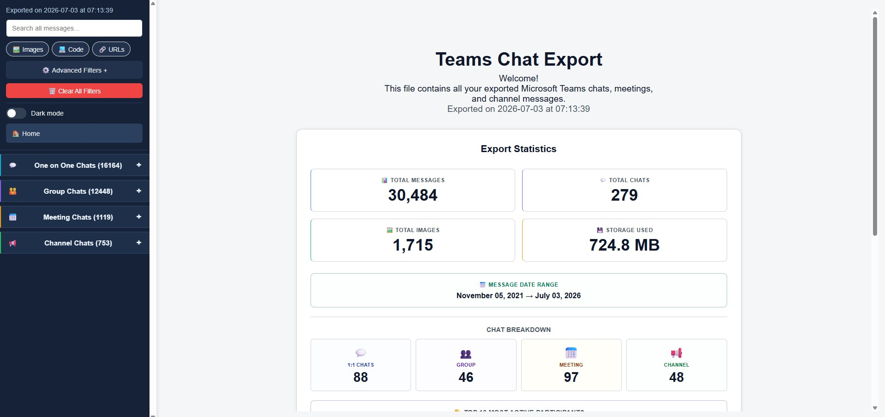

# Microsoft Teams Chat Export

A Python script that exports Microsoft Teams chats, group conversations, meetings, and channel messages to a single, searchable HTML file with embedded images and intuitive navigation.

## 📋 Table of Contents

- [Features](#-features)
- [Screenshots](#-screenshots)
- [Requirements](#-requirements)
- [Installation](#-installation)
- [Configuration](#-configuration)
- [Usage](#-usage)
- [Output](#-output)
- [Advanced Features](#-advanced-features)
- [Troubleshooting](#-troubleshooting)
- [Contributing](#-contributing)
- [License](#-license)

## ✨ Features

### Core Functionality
- **Complete Export**: Exports all one-on-one chats, group chats, meeting chats, and team channel messages
- **Image Support**: Downloads and embeds images locally for offline viewing
- **HTML Output**: Generates a single, self-contained HTML file with all your Teams data
- **Search Functionality**: Built-in search across all messages and conversations
- **Responsive Design**: Works on desktop and mobile devices

### User Experience
- **Sidebar Navigation**: Organized sidebar with collapsible sections for easy browsing
- **Message Filtering**: Automatically filters out system messages and empty content
- **Lightbox Images**: Click images to view them in a fullscreen lightbox
- **Scroll Navigation**: Quick scroll-to-top and scroll-to-bottom buttons
- **Member Lists**: Shows chat participants with tooltips for group conversations
- **Date Separators**: Day-by-day dividers inside chats for quicker temporal scanning
- **Dark Mode**: One-click toggle with saved preference
- **Search Highlights**: Matched terms are highlighted directly in messages

### Advanced Features

### What’s New (UI/UX)
- **Filter Panel Redesign**: Collapsible advanced filters with quick tags for Images and Code, active filter chips, and a Clear All button.
- **Smarter Filtering**: Hides chats/channels and date separators with zero matches during filtering; restores original counts when cleared.
- **State Preservation**: Keeps your expanded/collapsed sidebar state intact when applying/clearing filters; Home collapses everything consistently.
- **Breadcrumbs + Home**: Breadcrumb updates on chat selection; Home returns to cover page and resets navigation states.
- **Copy Message**: Per-message copy button for quick clipboard access to plain text.
- **Per-Chat Export**: Export the currently visible messages of the selected chat to TXT, Markdown, or print‑friendly HTML. The export bar sits under the chat title and, for group/meeting chats, directly under the Members section.
- **Statistics Panel**: Cover page now includes total messages, chats, images, storage size, optional date range, and Top 10 participants.
- **Ignore Lists**: Configure which channels and chats to skip during export
- **Automatic User Detection**: Automatically identifies your display name from Microsoft Graph API
- **Progress Tracking**: Real-time progress updates during export process
- **Error Handling**: Robust error handling with graceful fallbacks
- **Compact Display**: Optimized HTML output for minimal file size and clean appearance

## 📸 Screenshots

*The exported HTML file provides a clean, Teams-like interface with:*
- 
 - **Copy Button**: One-click copy of message text
 - **Sticky Export Bar**: Per-chat export toolbar under the chat header or members block
- **Sidebar Navigation**: Browse all your chats and channels
- **Message Display**: Clean message layout with timestamps and sender information
- **Search Bar**: Filter messages across all conversations
- **Image Gallery**: Embedded images with lightbox viewing

## 🔧 Requirements
- **Code-only Filter**: Show only messages that contain code blocks
- **Date Range Filter**: Optional from/to date filter with an “Apply date filter” toggle
- **Quick Tags**: One-click “Images” and “Code” tags toggle hidden filters and restyle to indicate state
- **Active Filters Chips**: Compact pills show the in-effect filters; Clear All removes them in one click
- **Live Message Counts**: See message counts update on sidebar items as you filter
- **Smart Visibility**: Chats/channels with no matches automatically hide while filtering; date separators hide if no visible messages beneath
- **Consistent Behavior**: Filtering is unified across 1-on-1, group, meetings, and channels
- **State Preservation**: Expanded/collapsed state for teams and Channel Chats is preserved while filtering and after clearing
- **Restore Counts**: Original permanent message counts restore when clearing filters

### Per-Chat Export

- **Formats**: TXT, Markdown (.md), and print-friendly HTML
- **Scope**: Exports only currently visible messages (respects all active filters)
- **Placement**: Toolbar appears under the chat title and, when available, directly under the Members section in group/meeting chats
- **Content Handling**:
    - TXT: Plain text with image URLs listed
    - MD: Sender bolded, code blocks fenced, images embedded with Markdown syntax
    - HTML: Minimal, printer-friendly layout preserving message HTML and images

### Python Dependencies
```
requests>=2.25.0
```

### Microsoft Graph API Access
- Valid Microsoft Graph API access token with the following permissions:
 - **Stats Panel**: On the cover page, shows totals, date range (if available), and top participants
 - **Per-Chat Export**: Toolbar for exporting the active chat in TXT/MD/HTML
  - `Chat.ReadWrite`
  - `ChannelMessage.Read.All`
  - `Team.ReadBasic.All`
  - `User.Read`
  - `Directory.Read.All`

## 🚀 Installation

### 1. Clone or Download
```bash
git clone <repository-url>
# OR download the ZIP file and extract it
```

### 2. Install Dependencies
```bash
pip install requests
```

### 3. File Structure
Ensure your directory contains these files:
```
restTeams/
├── teams_chat_export.py    # Main script
├── config.py              # Configuration file
├── html_template.py       # HTML template
├── teams_utils.py         # Utility functions
└── README.md             # This file
```

## ⚙️ Configuration

### 1. Get Microsoft Graph API Access Token

**Option A: Using Graph Explorer (Recommended for testing)**
1. Go to [Microsoft Graph Explorer](https://developer.microsoft.com/en-us/graph/graph-explorer)
2. Sign in with your Microsoft account
3. Run any query to generate a token
4. Copy the token from the request headers

**Option B: Azure App Registration (Recommended for production)**
1. Create an Azure AD app registration
2. Configure required permissions (see Requirements section)
3. Generate an access token using your preferred authentication flow

### 2. Configure the Script

Edit `config.py` and update the following:

```python
# Replace with your actual access token
ACCESS_TOKEN = 'your_access_token_here'

# Update output folder path (optional)
OUTPUT_FOLDER = 'C:\\your\\desired\\output\\path\\'

# Configure date range filtering (optional)
MESSAGE_DATE_FROM = "2024-01-01"  # Start date (YYYY-MM-DD) or None for no limit
MESSAGE_DATE_TO = "2024-12-31"    # End date (YYYY-MM-DD) or None for no limit

# Configure image download behavior (optional)
DOWNLOAD_IMAGES = True  # Set to False to use placeholder images instead

# Configure ignore lists (optional)
IGNORED_CHANNELS = [
    ("Team Name", "Channel Name"),  # Channels to skip
]

IGNORED_CHATS = [
    "Chat Name to Skip",  # Chats to skip
]
```

### 3. Important Configuration Notes

- **Access Token**: The script will automatically detect your user display name from the token
- **Paths**: Use absolute paths for `OUTPUT_FOLDER` to avoid issues
- **Date Range**: Filter messages by date range using `MESSAGE_DATE_FROM` and `MESSAGE_DATE_TO` (format: "YYYY-MM-DD" or None)
- **Image Downloads**: Set `DOWNLOAD_IMAGES = False` to use placeholder images and reduce export time/size
- **Ignore Lists**: Use these to skip large or unimportant channels/chats
- **Case Sensitivity**: Team/channel names in ignore lists are case-sensitive

### 4. Optional Configuration Features

#### Date Range Filtering

Filter messages by date to export only messages within a specific time period:

```python
# Export only messages from November 2024
MESSAGE_DATE_FROM = "2024-11-01"  # Start date (inclusive)
MESSAGE_DATE_TO = "2024-11-30"    # End date (inclusive)

# Export all messages from a specific date onwards
MESSAGE_DATE_FROM = "2024-01-01"
MESSAGE_DATE_TO = None

# Export all messages up to a specific date
MESSAGE_DATE_FROM = None
MESSAGE_DATE_TO = "2024-12-31"

# No date filtering (default - export all messages)
MESSAGE_DATE_FROM = None
MESSAGE_DATE_TO = None
```

**Benefits:**
- Faster exports when you only need recent messages
- Smaller file sizes
- Images outside date range won't be downloaded

#### Image Download Toggle

Control whether images are downloaded and embedded:

```python
# Download all images (default)
DOWNLOAD_IMAGES = True

# Use placeholder images instead
DOWNLOAD_IMAGES = False
```

**When to use `DOWNLOAD_IMAGES = False`:**
- Faster export times (no image downloads)
- Smaller output file size
- Testing/previewing export structure
- Internet connectivity issues
- Storage space concerns

**Note:** Placeholder images will display with a message indicating images were not downloaded.

#### Testing Limits

For faster testing and development, you can limit the number of messages and chats processed:

```python
# Limit messages per chat for faster testing (set to None for production)
MESSAGES_LIMIT_PER_CHAT = 50  # Examples: 50, 100, 500, or None for unlimited

# Limit number of chats to process for faster testing (set to None for production)
CHATS_LIMIT = 5  # Examples: 5, 10, 20, or None for unlimited

# Limit number of channels per team for faster testing (set to None for production)
# If left as None, the script falls back to CHATS_LIMIT when set
CHANNELS_LIMIT_PER_TEAM = None  # Examples: 3, 5, 10, or None for unlimited
```

**Examples:**
- For quick testing: `CHATS_LIMIT = 3`, `MESSAGES_LIMIT_PER_CHAT = 50`, and `CHANNELS_LIMIT_PER_TEAM = 3`
- For full export: Set all to `None`

## 📖 Usage

### Basic Usage

1. **Configure your access token** in `config.py`
2. **Run the script**:
   ```bash
   python teams_chat_export.py
   ```
3. **Wait for completion** - the script will show progress updates
4. **Open the generated HTML file** in your browser

### Command Line Output Example

```
### Microsoft Teams Chat Export Started
Script Version: v0.1.7
✅ Fetched user display name: Your Name
✅ Access token valid - authenticated as: Your Name
##  Fetching all chats
Found 45 total chats
#   Processing: Chat with John Doe
#   Processing: Group: Team Meeting
Processed 12 one-on-one chats
Processed 8 group chats
Processed 3 meeting chats
##  Fetching teams and channels
#   Processing team: Development Team
#     Processing channel: General...(156 total, 142 with content)
##  Generating HTML export
##  Processing chat messages
#   Fetching messages for chat: Chat with John Doe...(89 messages)
✅ Successfully exported to 'C:\path\to\output\index.html'
### Export completed successfully!
```

### Advanced Usage

**Selective Export with Ignore Lists:**
```python
# In config.py
IGNORED_CHANNELS = [
    ("Large Team", "General"),      # Skip busy general channel
    ("Announcements", "Company"),   # Skip announcement channel
]

IGNORED_CHATS = [
    "Bot Notifications",            # Skip automated chats
]
```

## 📂 Output

### Generated Files

The script creates the following structure in your output folder:

```
output/
├── index.html           # Main export file (open this in browser)
├── img/                # Downloaded images folder
│   ├── image1.jpg
│   ├── image2.png
│   └── ...
```

### HTML File Features

- **Self-contained**: All CSS and JavaScript embedded
- **Offline viewing**: Images stored locally
- **Responsive**: Works on all screen sizes
- **Searchable**: Real-time message filtering
- **Navigable**: Sidebar with expandable sections

## 🔧 Advanced Features

### Ignore Lists

Configure channels and chats to skip during export:

```python
# Skip specific team channels
IGNORED_CHANNELS = [
    ("Marketing Team", "Random"),
    ("Development", "Build-Notifications"),
]

# Skip specific chats
IGNORED_CHATS = [
    "Automated Reports",
    "System Notifications",
]
```

### Automatic User Detection

The script automatically:
- Fetches your display name from Microsoft Graph API
- Identifies your messages in conversations
- Applies appropriate styling (your messages vs. others)

### Progress Tracking

Real-time updates show:
- Number of chats/channels being processed
- Message counts for each conversation
- Export progress and completion status

### Search and Filtering

The HTML export includes advanced search capabilities:
- **Real-time Search**: Filter messages by text across all conversations
- **Sender Filter**: Filter messages by sender name substring across all conversations
- **Image-only Filter**: Toggle to show only messages containing images
- **URL Filter**: Quick filter option to show only messages containing URLs
- **Combined Filtering**: Search and filters work together (AND logic)
- **Live Message Counts**: See message counts update as you filter
- **Smart Visibility**: Chats/channels with no matches automatically hide while filtering
- **Consistent Behavior**: All chat types (1-on-1, group, meetings, channels) support unified filtering
- **Restore Counts**: Original permanent message counts restore when clearing filters

### Error Handling

The script handles:
- Invalid or expired access tokens
- Network connectivity issues
- Malformed message data
- Missing images or attachments

## 🔍 Troubleshooting

### Common Issues

**1. "Access token validation failed"**
```
❌ Access token validation failed: Token is invalid or expired
```
**Solution**: Generate a new access token and update `config.py`

**2. "Permission denied" errors**
```
❌ Error: Insufficient privileges to complete the operation
```
**Solution**: Ensure your access token has the required Microsoft Graph permissions

**3. "No messages found"**
```
Found 0 total chats
```
**Solution**: 
- Verify you have Teams conversations
- Check if your token has `Chat.ReadWrite` permission
- Ensure you're signed in to the correct Microsoft account

**4. Images not displaying**
```
Images show as broken links in the HTML file
```
**Solution**:
- Check internet connectivity during export
- Verify the `img/` folder exists in the output directory
- Ensure sufficient disk space for image downloads

### Debug Mode

To enable detailed error messages, uncomment this line in `teams_chat_export.py`:
```python
# Uncomment for debugging
print(f"Error processing message: {e}")
```

### Token Permissions

Required Microsoft Graph permissions:
- `Chat.ReadWrite` - Read chat messages
- `ChannelMessage.Read.All` - Read channel messages  
- `Team.ReadBasic.All` - List teams and channels
- `User.Read` - Get user profile information
- `Directory.Read.All` - Read user directory (for member names)

## 🤝 Contributing

Contributions are welcome! Please feel free to submit issues, feature requests, or pull requests.

### Development Setup

1. Fork the repository
2. Create a feature branch
3. Make your changes
4. Test thoroughly
5. Submit a pull request

### Code Style

- Follow PEP 8 Python style guidelines
- Add docstrings for new functions
- Include type hints where appropriate
- Test with different Teams configurations

## 📄 License

This project is provided as-is for educational and personal use. Please ensure you comply with your organization's data export policies and Microsoft's terms of service when using this script.

## 🔗 Links

- [Microsoft Graph API Documentation](https://docs.microsoft.com/en-us/graph/)
- [Graph Explorer](https://developer.microsoft.com/en-us/graph/graph-explorer)
- [Azure App Registration Guide](https://docs.microsoft.com/en-us/azure/active-directory/develop/quickstart-register-app)

---

**Version**: v0.1.5.1
**Last Updated**: January 2026  
**Tested with**: Microsoft Teams Web, Desktop App  
**Python Compatibility**: 3.6+
